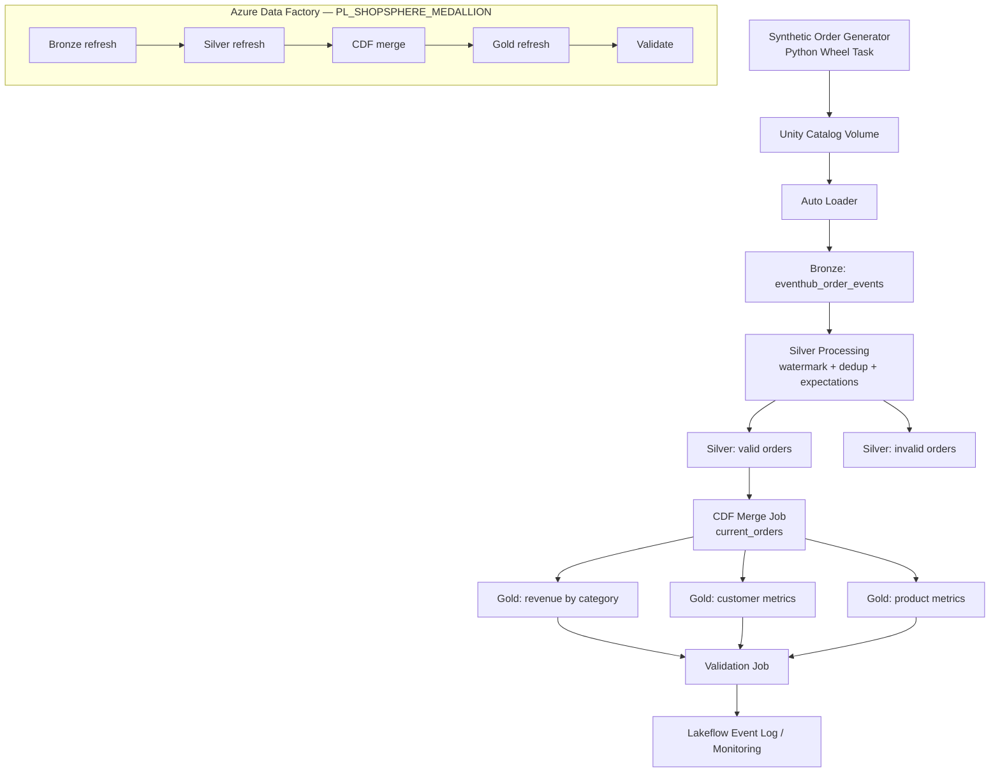

# ShopSphere Data Platform

An end-to-end e-commerce data engineering platform, built in two stages as a deliberate
migration exercise:

1. **v1 — local/self-managed**: Kafka, Apache Spark Structured Streaming, Docker, Delta Lake.
2. **v2 — managed Azure**: Event Hubs (Kafka-compatible), Azure Databricks Lakeflow
   Declarative Pipelines, Unity Catalog, Auto Loader, Delta Lake, and Azure Data Factory
   for orchestration — deployed via Databricks Asset/Declarative Bundles.

v2 is the primary implementation; v1 is preserved under `legacy/` as the original prototype.
See [Migration notes](#why-the-migration) below for why the move happened.

## Architecture



ADF orchestrates the sequence above end-to-end — see [`orchestration/adf/`](orchestration/adf/)
for the pipeline definition and design notes.

## Key engineering details

- **Idempotent incremental processing**: `cdf_merge.py` tracks the last processed Delta
  CDF version in a state table, reads only the unprocessed version range, and advances
  the checkpoint only after the MERGE succeeds — safe to retry without reprocessing.
- **Data quality enforcement**: Lakeflow `expect_all_or_drop` rules on Silver, with
  failing records routed to a quarantine table (`invalid_orders`) with explicit
  per-record failure reasons rather than being silently dropped.
- **Event-time correctness**: watermarking + `event_id` dedup in Silver; ~5% of
  generated events are deliberately backdated to simulate late arrivals.
- **Reconciliation**: `validate_outputs.py` checks bronze vs. silver+invalid counts,
  confirms no gold table is empty, and fails the run loudly on mismatch.
- **Deployment as code**: Databricks Declarative Bundles manage dev/prod targets.

## Repo structure

| Path | What it is |
|---|---|
| `databricks_bundle/` | v2 implementation — Lakeflow pipelines, jobs, DAB config |
| `orchestration/adf/` | ADF pipeline orchestrating the Databricks stages |
| `ingestion/` | Synthetic event generators + Event Hubs producer |
| `legacy/local_spark_v1/` | v1 prototype — self-managed Kafka + Spark |
| `experiments/` | Scratch notebooks/scripts used while developing CDF handling |
| `docs/` | Architecture, data flow, deployment, monitoring detail |

## Setup & run

### v2 (Databricks)
```bash
cd databricks_bundle
databricks bundle validate -t dev --profile shopsphere-dev
databricks bundle deploy -t dev --profile shopsphere-dev
```
See [`docs/deployment.md`](docs/deployment.md) for full details.

### v1 (local Kafka/Spark)
```bash
cd legacy/local_spark_v1
docker compose -f docker/docker-compose.yml up
```

### Tests
```bash
pip install -r requirements.txt
pytest legacy/local_spark_v1/tests
```

## Why the migration

v1 proved the medallion pattern end-to-end locally but required self-managing Kafka,
Spark cluster lifecycle, and checkpoint storage. v2 moves ingestion to Event Hubs
(Kafka-compatible, so the schema and producer logic carried over), replaces manual
Spark job management with Lakeflow Declarative Pipelines (managed compute, built-in
expectations, event log), and adds ADF for cross-system orchestration and Databricks
Asset Bundles for repeatable, environment-scoped deployment.

## Docs

- [Architecture](docs/architecture.md)
- [Data flow](docs/data-flow.md)
- [Deployment](docs/deployment.md)
- [Monitoring](docs/monitoring.md)
- [ADF orchestration](orchestration/adf/README.md)